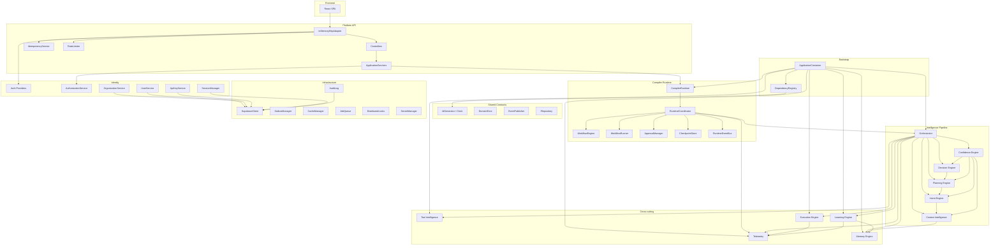

# Dependency Graph

## Dependency Rules

1. **Downward only**: Higher layers depend on lower layers, never reverse
2. **No circular imports**: Verified by typecheck
3. **Interfaces over classes**: All cross-module dependencies are interface-based
4. **Bootstrap is the only wiring point**: No direct `new` outside bootstrap (except orchestrator's internal engines — known tech debt)
