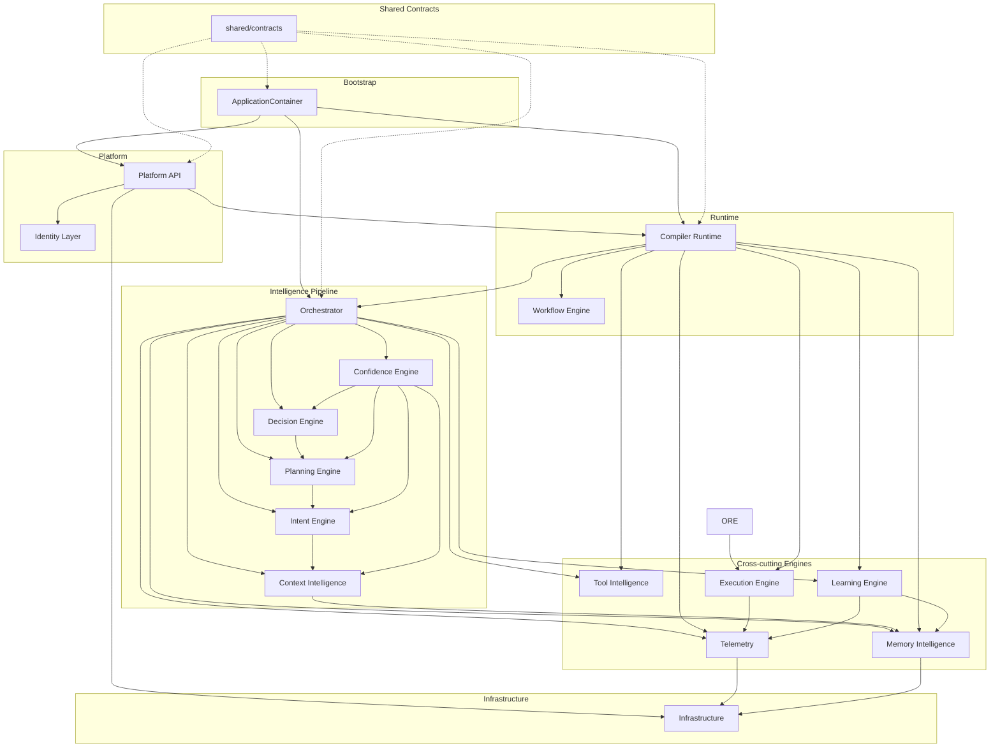

# Module Inventory

## Summary

| Module | Path | Responsibility | Status |
|--------|------|----------------|--------|
| Context Intelligence | `src/compiler/core/intelligence/context/` | Analyzes business prompts, enriches with memory, validates sufficiency | Integrated |
| Intent Engine | `src/compiler/core/intelligence/intent/` | Classifies business intent, urgency, complexity | Integrated |
| Planning Engine | `src/compiler/core/intelligence/planning/` | Generates execution plans with DAG, risk, approval requirements | Integrated |
| Decision Engine | `src/compiler/core/intelligence/decision/` | Evaluates alternatives, detects conflicts, validates decisions | Integrated |
| Confidence Engine | `src/compiler/core/intelligence/confidence/` | Calculates confidence scores, uncertainty, evidence, escalation | Integrated |
| Orchestrator | `src/compiler/core/intelligence/orchestrator/` | Runs the 5-stage pipeline: Context→Intent→Plan→Decision→Confidence | Integrated |
| Telemetry Engine | `src/compiler/core/intelligence/telemetry/` | Traces, metrics, explainability, event bus | Integrated |
| Memory Intelligence | `src/compiler/core/intelligence/memory/` | Stores/retrieves/consolidates org-scoped memory entries | Integrated |
| Tool Intelligence | `src/compiler/core/intelligence/tools/` | Discovers, selects, validates tools; builds execution plans | Integrated |
| Execution Engine | `src/compiler/core/intelligence/execution/` | Executes tool plans with retry, timeout, compensation | Integrated |
| Learning Engine | `src/compiler/core/intelligence/learning/` | Extracts patterns, generates recommendations from outcomes | Integrated |
| Compiler Runtime | `src/compiler/runtime/` | Coordinates workflow execution, checkpoints, approvals | Integrated |
| Workflow Engine | `src/compiler/runtime/workflow/` | Builds, schedules, runs, resumes, cancels workflows | Integrated |
| Platform API | `src/platform/api/` | HTTP adapter, routes, controllers, DTOs, idempotency | Integrated |
| Identity Layer | `src/platform/identity/` | Auth, RBAC, orgs, users, API keys, sessions | Integrated |
| Infrastructure | `src/infrastructure/` | DB, cache, queue, locks, outbox, secrets, health, audit | Integrated |
| Shared Contracts | `src/shared/contracts/` | Canonical IdGenerator, Clock, DomainError, EventPublisher, Repository | New (Sprint 15A) |
| Bootstrap | `src/bootstrap/` | Composition root — wires all modules via DI | New (Sprint 15A) |

## Dependency Graph (Mermaid)

## Per-Module Detail

### Context Intelligence
- **Path**: `src/compiler/core/intelligence/context/`
- **Services**: ContextAnalyzer, ContextEnricher, ContextValidator
- **Consumes**: ContextRequest, EnterpriseMemorySnapshot
- **Exposes**: ContextResult, ContextEnrichment, ValidationOutcome
- **Incoming deps**: Orchestrator, ContextIntelligenceService
- **Outgoing deps**: Memory (for enrichment)
- **Integration status**: Fully integrated
- **Duplications**: None detected
- **Risks**: None

### Intent Engine
- **Path**: `src/compiler/core/intelligence/intent/`
- **Services**: IntentEngine, IntentClassifier, IntentValidator
- **Consumes**: ContextResult, ContextRequest
- **Exposes**: IntentResult, IntentClassification
- **Incoming deps**: Orchestrator
- **Outgoing deps**: None
- **Integration status**: Fully integrated
- **Duplications**: IntentClassifier exists in both `core/reasoning/` and `intelligence/intent/` — the intelligence version is canonical
- **Risks**: Low — duplicate class name in reasoning/

### Planning Engine
- **Path**: `src/compiler/core/intelligence/planning/`
- **Services**: PlanningEngine, PlanGenerator, ExecutionGraphBuilder, PlanValidator, PlanRiskAnalyzer
- **Consumes**: IntentResult
- **Exposes**: ExecutionPlan, ExecutionGraph, PlanNode, PlanEdge
- **Incoming deps**: Orchestrator
- **Outgoing deps**: None
- **Integration status**: Fully integrated
- **Duplications**: None
- **Risks**: None

### Decision Engine
- **Path**: `src/compiler/core/intelligence/decision/`
- **Services**: DecisionEngine, AlternativeGenerator, AlternativeEvaluator, ConflictDetector, DecisionValidator, DecisionExtractor
- **Consumes**: DecisionRequest (contains ExecutionPlan)
- **Exposes**: DecisionResult, DecisionAlternative
- **Incoming deps**: Orchestrator
- **Outgoing deps**: None
- **Integration status**: Fully integrated
- **Duplications**: None
- **Risks**: None

### Confidence Engine
- **Path**: `src/compiler/core/intelligence/confidence/`
- **Services**: ConfidenceEngine, ConfidenceCalculator, UncertaintyAnalyzer, EvidenceEvaluator, ConfidenceValidator
- **Consumes**: ConfidenceRequest (contains all prior results)
- **Exposes**: ConfidenceResult, ConfidenceAssessment
- **Incoming deps**: Orchestrator
- **Outgoing deps**: None
- **Integration status**: Fully integrated
- **Duplications**: None
- **Risks**: None

### Orchestrator
- **Path**: `src/compiler/core/intelligence/orchestrator/`
- **Services**: CompilerIntelligenceOrchestrator
- **Consumes**: CompilerIntelligenceRequest
- **Exposes**: CompilerIntelligenceResult
- **Incoming deps**: Runtime, Platform API
- **Outgoing deps**: Context, Intent, Planning, Decision, Confidence, Telemetry, Memory, Tools, Execution, Learning
- **Integration status**: Fully integrated — runs all 5 stages + post-pipeline side effects
- **Duplications**: Orchestrator directly instantiates ContextIntelligenceService, IntentEngine, PlanningEngine, DecisionEngine, ConfidenceEngine in constructor instead of receiving them via DI
- **Risks**: MEDIUM — direct instantiation limits testability and swap-ability

### Telemetry Engine
- **Path**: `src/compiler/core/intelligence/telemetry/`
- **Services**: TelemetryEngine, TelemetryEventBus, MetricsCollector, TraceBuilder, ExplainabilityBuilder
- **Consumes**: Stage events, pipeline events
- **Exposes**: ITelemetryEngine, ExecutionTrace, TelemetryMetrics, ExplainabilityRecord
- **Incoming deps**: Orchestrator, Runtime, Execution, Learning
- **Outgoing deps**: None
- **Integration status**: Fully integrated
- **Duplications**: TelemetryEventBus is separate from RuntimeEventBus — parallel event systems
- **Risks**: MEDIUM — two event buses with no shared base

### Memory Intelligence
- **Path**: `src/compiler/core/intelligence/memory/`
- **Services**: MemoryEngine, InMemoryMemoryRepository, MemoryExtractor, MemoryValidator, MemoryRetriever, MemoryRanker, MemoryConsolidator, MemoryLifecycleManager
- **Consumes**: MemoryWriteRequest, MemoryQuery
- **Exposes**: MemoryEntry, MemoryRetrievalResult
- **Incoming deps**: Orchestrator, Runtime, Execution, Learning
- **Outgoing deps**: None
- **Integration status**: Fully integrated
- **Duplications**: MemoryEntry type duplicated in `core/interfaces/IMemoryProvider.ts` and `intelligence/memory/models/MemoryEntry.ts`
- **Risks**: Low — two MemoryEntry types with same name

### Tool Intelligence
- **Path**: `src/compiler/core/intelligence/tools/`
- **Services**: ToolIntelligenceEngine, ToolRegistry, ToolDiscoveryService, ToolSelector, ToolEligibilityValidator, ToolPermissionEvaluator, ToolRiskAnalyzer, ToolPlanBuilder
- **Consumes**: ToolSelectionContext, ToolPolicy
- **Exposes**: ToolExecutionPlan, ToolCandidate, ToolSelection
- **Incoming deps**: Orchestrator
- **Outgoing deps**: None
- **Integration status**: Fully integrated
- **Duplications**: None
- **Risks**: None

### Execution Engine
- **Path**: `src/compiler/core/intelligence/execution/`
- **Services**: ExecutionEngine, ExecutionCoordinator, ToolExecutor, RetryManager, TimeoutManager, CompensationManager, ExecutionPolicyValidator, ExecutionResultBuilder, SimulatedToolAdapter
- **Consumes**: ExecutionRequest (contains ToolExecutionPlan + ToolPolicy)
- **Exposes**: ExecutionResult, StepResult, ExecutionEvent
- **Incoming deps**: Orchestrator, Runtime
- **Outgoing deps**: Telemetry (for event forwarding)
- **Integration status**: Fully integrated
- **Duplications**: IExecutionResultBuilder parallels IRuntimeResultBuilder — both assemble results from execution + events + errors
- **Risks**: MEDIUM — hardcoded 'ConfidenceCalculated' telemetry event type

### Learning Engine
- **Path**: `src/compiler/core/intelligence/learning/`
- **Services**: LearningEngine, InMemoryLearningRepository, OutcomeEvaluator, FeedbackProcessor, PatternExtractor, RecommendationGenerator, LearningValidator
- **Consumes**: LearningInput[]
- **Exposes**: LearningRecord, LearningPattern, LearningRecommendation
- **Incoming deps**: Orchestrator
- **Outgoing deps**: Telemetry, Memory
- **Integration status**: Fully integrated
- **Duplications**: ILearningRepository has same shape as IRuntimeRepository, IWorkflowRepository — missing generic IRepository<T>
- **Risks**: Low

### Compiler Runtime
- **Path**: `src/compiler/runtime/`
- **Services**: CompilerRuntime, RuntimeCoordinator, RuntimeStateManager, RuntimeRequestValidator, RuntimeResultBuilder, ApprovalManager, ApprovalPolicyEvaluator, HumanTaskManager, RuntimeEventBus
- **Consumes**: RuntimeRequest
- **Exposes**: RuntimeResult, RuntimeExecution, RuntimeEvent
- **Incoming deps**: Platform API
- **Outgoing deps**: Orchestrator, Telemetry, Memory, Tools, Execution, Learning
- **Integration status**: Fully integrated
- **Duplications**: CompilerRuntime directly instantiates InMemory repositories in constructor — limits testing
- **Risks**: MEDIUM — hardcoded in-memory repos, can't swap for Postgres

### Workflow Engine
- **Path**: `src/compiler/runtime/workflow/`
- **Services**: WorkflowEngine, WorkflowGraphBuilder, WorkflowScheduler, WorkflowRunner, WorkflowResumeManager, WorkflowCancellationManager, WorkflowDefinitionValidator
- **Consumes**: WorkflowDefinition, RuntimeRequest
- **Exposes**: WorkflowExecution
- **Incoming deps**: Runtime
- **Outgoing deps**: None (uses context.events directly)
- **Integration status**: Integrated but bypasses RuntimeEventBus
- **Duplications**: WorkflowRunner.makeEvent() duplicates RuntimeEventBus.emit() — same RuntimeEvent shape built manually
- **Risks**: HIGH — event stream inconsistency (two event paths)

### Platform API
- **Path**: `src/platform/api/`
- **Services**: InMemoryHttpAdapter, RouteRegistry, 6 controllers, 5 application services, IdempotencyService, RateLimiter
- **Consumes**: HttpRequest
- **Exposes**: HttpResponse, DTOs, error codes
- **Incoming deps**: External callers
- **Outgoing deps**: Runtime, Identity
- **Integration status**: Fully integrated
- **Duplications**: WorkflowApplicationService keeps its own Map<string, WorkflowDefinition[]> — duplicates IWorkflowRepository. ApplicationServices uses ad-hoc Object.assign(new Error(), {code}) — fourth error pattern.
- **Risks**: HIGH — no shared error base, clock leaks (new Date().toISOString() bypasses injected clock)

### Identity Layer
- **Path**: `src/platform/identity/`
- **Services**: OrganizationService, UserService, ApiKeyService, SessionManager, RolePermissionResolver, AuthorizationService, 5 middleware, CompositeAuthenticationProvider
- **Consumes**: Auth credentials, org/user/role models
- **Exposes**: AuthenticatedPrincipal, AuthorizationService, 8 repository interfaces
- **Incoming deps**: Platform API
- **Outgoing deps**: Infrastructure (AuditLog)
- **Integration status**: Fully integrated (Sprint 15)
- **Duplications**: Defines its own IdGenerator/Clock inline — now consolidated via shared/contracts
- **Risks**: Low

### Infrastructure
- **Path**: `src/infrastructure/`
- **Services**: SupabaseDatabaseClient, TransactionManager, OutboxManager, JobQueue, CacheManager, DistributedLocks, SecretManager, HealthChecks, AuditLog, DataRetention, InfrastructureMetrics
- **Consumes**: DB connection, config
- **Exposes**: Async repository interfaces, Postgres repositories, schema types, mappers
- **Incoming deps**: Runtime, Platform API
- **Outgoing deps**: Supabase
- **Integration status**: Fully integrated
- **Duplications**: InfrastructureError has code + retryable but RuntimeError does not — incompatible error hierarchies. OutboxEvent is separate from all other event types.
- **Risks**: MEDIUM — error hierarchy fragmentation, no shared BaseEvent

### Shared Contracts (NEW)
- **Path**: `src/shared/contracts/`
- **Services**: IdGenerator, Clock, ClockWithMath, DomainError, InMemoryEventPublisher, InMemoryOrgScopedRepository
- **Consumes**: Nothing
- **Exposes**: Canonical types for IDs, timestamps, errors, events, repositories
- **Incoming deps**: Bootstrap
- **Outgoing deps**: None
- **Integration status**: New — ready for gradual adoption
- **Duplications**: This IS the consolidation of duplications
- **Risks**: Low — must be adopted gradually

### Bootstrap (NEW)
- **Path**: `src/bootstrap/`
- **Services**: ApplicationContainer, DependencyRegistry, createApplication, createTestApplication
- **Consumes**: All engine constructors
- **Exposes**: Single wired ApplicationContainer
- **Incoming deps**: Entry points (main, tests)
- **Outgoing deps**: All modules
- **Integration status**: New — replaces scattered instantiation
- **Duplications**: None — this IS the composition root
- **Risks**: Low
